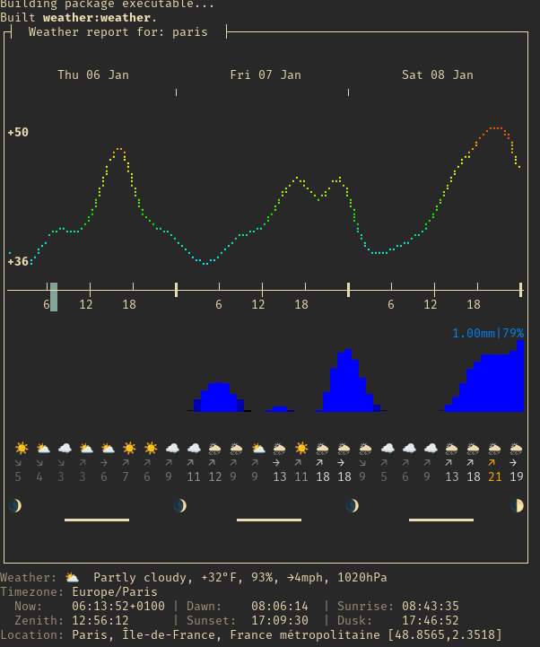

# Weather

CLI to display the weather in your terminal using the `http://v2.wttr.in/`
service.

Set up:

Clone repo and run

```bash
dart pub get
```

To run

```bash
dart run
```

Result:



To build and run executable

```bash
dart compile exe bin/weather

./bin/weather.exe
```
